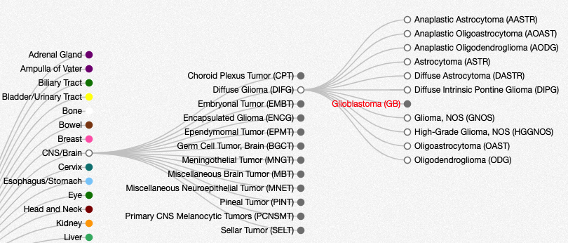

# Datasets
 
## Introduction

All data within cBioPortal is organized within studies.  You can think of a study as a published study with an accompanying research paper, or a pre-published study that has not yet made it to publication.  In the public cBioPortal, we maintain over 200 published cancer studies, and new studies are added all the time.

The exact details for each study will vary, but most studies are linked to a publication within PubMed, and contain some form of genomic profiling data coupled with de-identified clinical data. For example, the [Cholangiocarcinoma study from MSKCC](https://www.cbioportal.org/study/summary?id=chol_msk_2018) contains data on 192 patients. This includes mutation data and copy number data from a targeted gene panel, along with de-identified clinical data that was gathered from patient medical records.


For a complete list of studies within the cBioPortal page, go to:  https://www.cbioportal.org/datasets.  This page lists the study name, a publication reference, and number of samples for each data type, e.g. number of sequenced samples or number of samples with copy number data.


## Cancer Types

Where possible, each study within cBioPortal is associated with a specific cancer type, derived from the [OncoTree ontology](http://oncotree.mskcc.org/#/home).  The OncoTree ontology provides a tree-based structure for classifing cancers.  For example, Glioblastoma  is classified as a Diffuse Glioma, which is then categorized under CNS/Brain.  To find glioblastoma studies within cBioPortal, you can therefore select CNS/Brain studies and start browsing or simply enter "Glioblastoma" in the main search box.  Note that studies which span multiple cancer types are categorized as "Pan Cancer" studies.  We also maintain cell line studies, such as the Cancer Cell Line Encylopedia, which are categorized as "Cell Line" studies.


The cBioPortal only contains **de-identified clinical data**.  That means that we do not store any protected health information (PHI) for patients, such as birth dates or medical record numbers, but we do store de-identified data, such as overall survival, patient demographics and prior treatment.  Published cancer genomics studies, including TCGA and AACR GENIE also equire explict patient consent to share de-identified clinical data.


## TCGA Studies

*Under Construction*

## AACR GENIE

The cBioPortal team maintain a separate cBioPortal instance just for [AACR GENIE data](https://www.aacr.org/professionals/research/aacr-project-genie/).  AACR GENIE is a multi-institutional data sharing initiative focused on precision cancer medicine.  To access AACR GENIE data, you must first register and agree to the AACR GENIE terms of use.  Complete details are available at:  https://genie.cbioportal.org/.