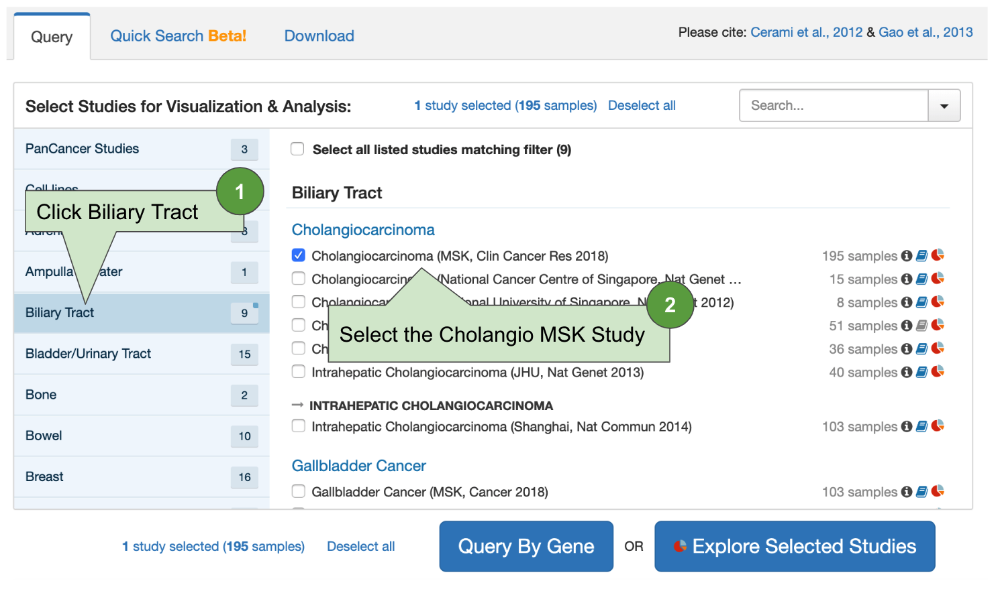
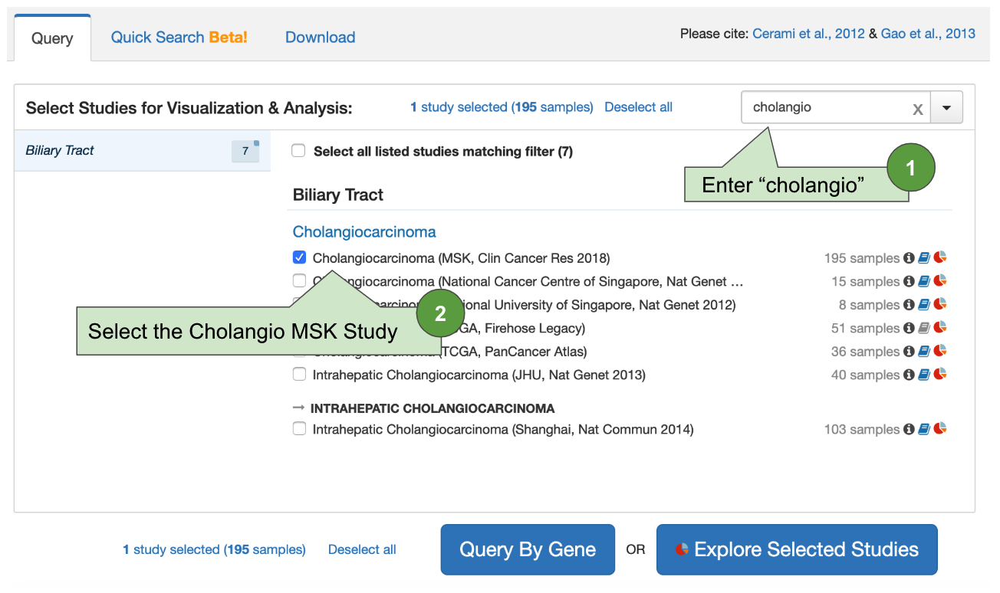

# Getting Started
 
To get started with cBioPortal, first go to:  https://www.cbioportal.org/.

From the home page, note the top navigation bar:

From here, you can drill-down to different sections of cBioPortal.  For beginners, the two most important tabs are "Tutorials" and "FAQ".

With that, you are ready to try your first query.  For this section, we will explore the [Cholangiocarcinoma study from MSKCC](https://www.cbioportal.org/study/summary?id=chol_msk_2018).  If you are interested, you can also access the paper on [PubMed Central](https://www.ncbi.nlm.nih.gov/pmc/articles/PMC6642361/).

From the home page, you have several options for getting started.

## Option 1:  Browse

In the first option, you can use the left navigation pane to **browse** by cancer type:

## Option 2:  Search

In the second option, you can use the search box to **search** by cancer type or study name:


There are lots of tricks you can use within the search box.  For example, you can quickly find all Pan-Cancer TCGA studies by entering:  "tcga pancancer".  Or, you can quickly find all TCGA Studies, but remove the Pan-Cancer Studies by entering:  "tcga -pancancer".


## Branching

Once you have selected your study, you have the option of selecting one of two options:

For now, click the "Query by Gene" button.

