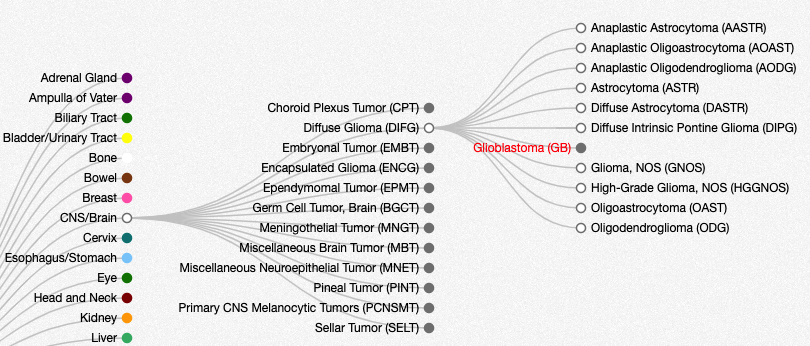

# Getting Started
 
To get started with cBioPortal, first go to:  https://www.cbioportal.org/.

From the home page, note the top navigation bar:

From here, you can drill-down to different sections of cBioPortal.  For beginners, the two most important tabs are "Tutorials" and "FAQs".

With that, you are ready to try your first query.  For this section, we will explore the [Cholangiocarcinoma study from MSKCC](https://www.cbioportal.org/study/summary?id=chol_msk_2018).  If you are interested, you can also access the paper on [PubMed Central](https://www.ncbi.nlm.nih.gov/pmc/articles/PMC6642361/).